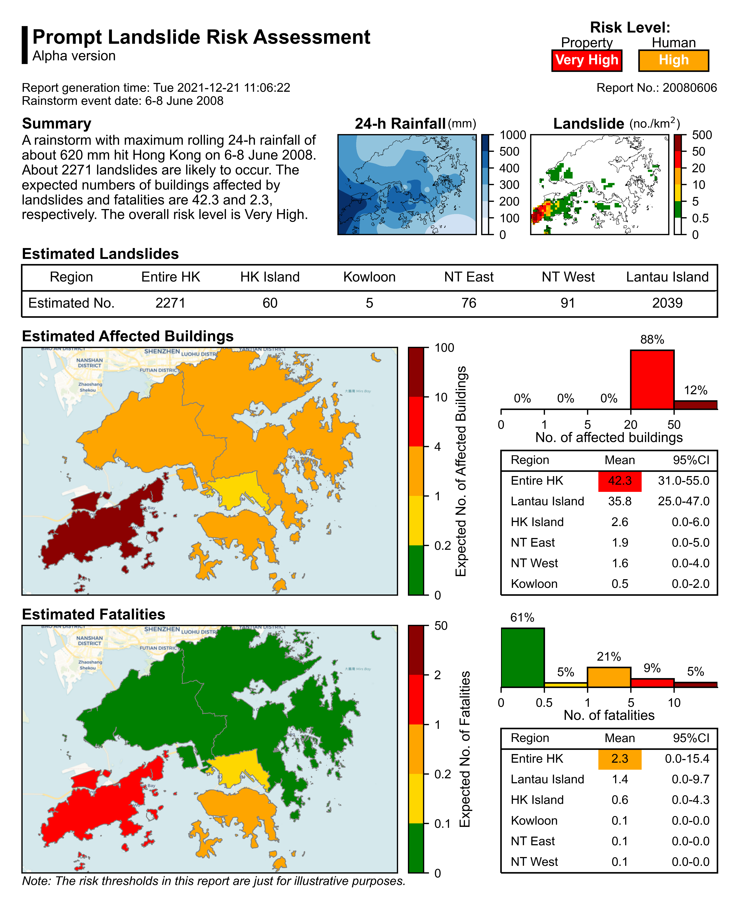

# Prompt Landslide Risk Assessment (PoLA)
## Contents
- [Overview](https://github.com/JianH-coding/PoLA#overview)
- [Repo Contents](https://github.com/JianH-coding/PoLA#repo-contents)
- [System Requirements](https://github.com/JianH-coding/PoLA#system-requirements)
- [Demo](https://github.com/JianH-coding/PoLA#demo)

## Overview
This is the computer code repo for the paper **Prompt Quantitative Risk Assessment for Rain-Induced Landslides**.

## Repo Contents
- input:
  - `Risk assessment input.txt` specifies the input settings.
  - `Rainfall` contains the rainfall file of the rainstorm on 6-8 June 2008 in Hong Kong.
- Database:
  - `Digital Hong Kong` contains geospatial datasets such as elevation, slope, geology. (The size of these files is too large for this repo. If you need these datasets, please contact Jian He at jhebl@connect.ust.hk.)
  - `Hazard Assessment` contains the rainfall-landslide frequency model, the rainfall-landslide volume model, probability distribution of landslide runout and landslide potential trails.
  - `Vulnerability Assessment` contains the landslide-human vulnerability model.
- Codes

## System Requirements
### Hardware Requirements
Recommended specs:
- CPU: Intel i7-7700 @ 3.6GHz
- Ram: 16GB

Minimum specs:
- CPU: 4 cores @ 3.3GHz
- Ram: 4GB

### Software Requirements
The codes have been tested only on a PC with Windows 10. The recommended Python version is >= 3.8. 

Other requirements of dependent python packages are listed in `requirements.txt`. 
A recommended way to install these packages is to use conda with the package file `pola.yaml`:
```
conda env update -n Pola --file pola.yaml
```

## Installation Guide
The codes can be downloaded as a ZIP file from this repo. No installation is needed.

## Demo
The codes can be excuted after unzip the file in the command line by
```
conda activate Pola
python promptriskassessment.py
```
The default input file is `input/Risk assessment input.txt`. To run the program with a specified input file, say `input/Risk assessment input 1.txt`, you can use the `-input` or `-i` option to specify the input file:
```
conda activate Pola
python promptriskassessment.py -i "input/Risk assessment input 1.txt"
```
Note that `python` should be added to the PATH system variable prior to running the code above in the command line. Another way to run the codes is using [Visual Studio Code](https://code.visualstudio.com/).

If the codes are runing for the first time, it will take several minutes (about 3 mins with the recommended specs) to generate files of potential landslide trails (`.json` files in `Hazard Assessment\Landslide Potential Trail`) and building locations (`Building Location.json` in `Digital Hong Kong\Building`). These files, once generated, will be reused next time.

If the files of potential landslide trails and building locations have been already generated, it will take about 3 mins with the recommended specs to assess landslide risk and genarate a one-page report as shown below:


